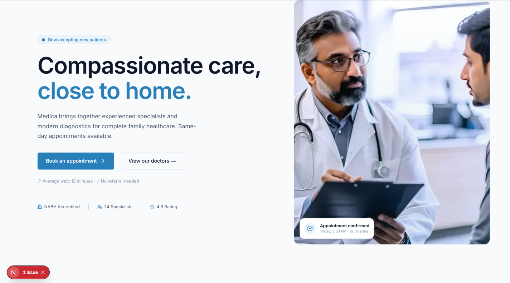

# Medica — Local Business (Project 03)

**Medica** is a modern healthcare clinic website designed for local service providers. Built with Next.js, it emphasizes accessibility, appointment booking, and patient information with a professional healthcare aesthetic.



## Overview

Medica provides a complete digital presence for local medical services:
- **Header & Navigation** — 24/7 emergency contact and quick booking CTA
- **Hero Section** — Clear value proposition with appointment CTAs
- **Departments** — Browse available medical specialties
- **Doctor Directory** — View physicians and book appointments
- **Testimonials** — Patient reviews and trust signals
- **FAQ Section** — Common patient questions answered
- **Patient Portal** — Links to patient information and resources

## Tech Stack

- **Framework**: Next.js 16 (App Router)
- **Styling**: Tailwind CSS 3
- **Animation**: Framer Motion
- **Forms**: React Hook Form + Zod
- **Icons**: Lucide React
- **Components**: `@agency/shared` from monorepo
- **Integration**: Airtable API for appointment/staff management

## Quick Start

### Prerequisites
- Node 18+
- pnpm 10.x

### Installation & Development

```bash
# Install dependencies
pnpm install

# Configure Airtable API (optional, see .env.example)
# Set NEXT_PUBLIC_AIRTABLE_API_KEY and AIRTABLE_BASE_ID

# Start dev server
pnpm dev
```

Open [http://localhost:3000](http://localhost:3000) to view the site.

### Production Build

```bash
pnpm build
pnpm start
```

## Project Structure

```
src/
├── app/
│   ├── page.tsx               # Home/landing page
│   ├── layout.tsx             # Root layout
│   ├── doctors/               # Doctor directory
│   ├── departments/           # Departments listing
│   ├── api/
│   │   ├── appointments/      # Appointment booking API
│   │   └── airtable/         # Airtable sync
│   └── globals.css           # Global styles
└── components/
    ├── sections/             # Home sections (Hero, Departments, etc)
    ├── ui/                   # Reusable UI components
    ├── forms/               # Booking and contact forms
    └── layout/              # Header, Footer, Navigation
```

## Key Features

### 1. **Appointment Booking System**
- React Hook Form integration for seamless UX
- Zod validation for data integrity
- Airtable backend for data storage
- Optional email notifications via Resend

### 2. **Doctor & Department Management**
- Airtable CMS for doctor profiles and availability
- Search and filter by specialty or location
- Staff directory with bios and credentials

### 3. **Patient Information**
- FAQ sections addressing common questions
- Health tips and medical resources
- Insurance and payment information
- HIPAA-compliant data handling

### 4. **Trust & Accessibility**
- WCAG 2.1 AA accessibility compliance
- Responsive design optimized for mobile
- Load time optimized for rural/slow connections
- Multiple contact methods (phone, email, form)

### 5. **SEO & Local Search**
- Structured data (Schema.org) for healthcare
- Local business markup for Google Maps
- Meta tags optimized for local search

## Customization Guide

### Colors & Branding
1. Update `tailwind.config.ts` for healthcare color scheme
2. Modify `src/components/layout/Header.tsx` with clinic logo
3. Update emergency contact number throughout site

### Content & Copy
- **Hero/home**: `src/app/page.tsx`
- **Doctor info**: Update via Airtable (or see `PRODUCT.md`)
- **Departments**: `src/components/sections/Departments.tsx`
- **FAQ**: `src/components/sections/FAQ.tsx`

### Airtable Integration
1. Create Airtable base with tables: `Doctors`, `Departments`, `Appointments`
2. Add API key to `.env.local`:
   ```
   NEXT_PUBLIC_AIRTABLE_API_KEY=your_key
   AIRTABLE_BASE_ID=your_base_id
   ```
3. See `test-airtable.js` for schema examples

### Appointment Form
- Validation rules: `src/lib/schemas/booking.ts`
- Form component: `src/components/forms/AppointmentForm.tsx`
- API route: `src/app/api/appointments/route.ts`

## Environment Variables

Required (optional for demo):
```
NEXT_PUBLIC_AIRTABLE_API_KEY=         # Airtable API key
AIRTABLE_BASE_ID=                      # Airtable base ID
RESEND_API_KEY=                        # For email notifications
NEXT_PUBLIC_CLINIC_PHONE=+91 98765 43210
```

## Dependencies

Key packages:
- `next`: 16.2.x — React framework
- `react`: 19.x — UI library
- `airtable`: ^7.x — Airtable integration
- `react-hook-form`: ^7.x — Form management
- `zod`: ^3.x — Schema validation
- `@agency/shared`: Shared components
- `next-themes`: Dark mode support

## Deployment

### Vercel (Recommended)
```bash
vercel deploy
```

### Other Platforms
Build and deploy `.next` folder. Ensure env vars are configured:
```bash
pnpm build
# Set env vars on hosting platform
# Deploy
```

## Healthcare Compliance Notes

- **HIPAA**: This template does NOT store PHI. Connect to HIPAA-compliant backend (e.g., Hapi FHIR, AWS HealthLake)
- **Appointments**: Use Airtable or your own backend; implement proper access controls
- **Data Privacy**: Add privacy policy and terms of service pages
- **Accessibility**: Tested to WCAG 2.1 AA standard; run axe DevTools to verify

## Testing

Run ESLint and type checking:
```bash
pnpm exec eslint src --max-warnings=0
pnpm type-check
```

Test Airtable connection:
```bash
node test-airtable.js
```

## Notes

- **Workspace Dependency**: Uses `@agency/shared` from monorepo
- **Airtable**: Optional but recommended for CMS; can replace with other backend
- **See Also**: Check `PRODUCT.md` for clinic-specific customization details

## License

MIT — Healthcare sites available for clinics, urgent care, dental, and more.
