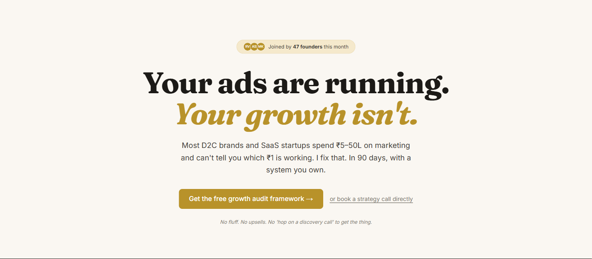

# Axiom Strategy — High-Ticket Marketing Systems (Project 05)

**Axiom Strategy** is a premium consulting site targeting D2C brands and SaaS founders. It positions Rohan as a growth strategist offering systematized 90-day programs with live lead magnet conversion, Calendly integration, and Supabase logging for lead tracking.



## Overview

Axiom Strategy demonstrates high-ticket B2B positioning:
- **Hero Section** — Problem-driven headline ("Your ads are running. Your growth isn't.")
- **Proof Tickers** — Social proof and featured placements
- **Problem/Solution Sections** — Deep dive on marketing gaps and Rohan's approach
- **About Rohan** — Personal brand and credentials
- **Process Section** — The 90-day system breakdown
- **Testimonials** — Client case studies and results
- **Results Gallery** — Portfolio of brand transformations
- **Lead Magnet** — Free "Growth Audit Framework" with email capture
- **Booking CTA** — Calendly embed for strategy calls

## Tech Stack

- **Framework**: Next.js 16 (App Router)
- **Styling**: Tailwind CSS 3
- **Animation**: Framer Motion + GSAP (scroll triggers, marquee)
- **Forms**: React Hook Form + Zod validation
- **Email Sending**: Resend (server-side API)
- **Database Logging**: Supabase PostgreSQL (optional)
- **Scheduling**: Calendly embed
- **Components**: `@agency/shared` from monorepo
- **Icons**: Lucide React

## Quick Start

### Prerequisites
- Node 18+
- pnpm 10.x

### Installation & Development

```bash
# Install dependencies
pnpm install

# Configure environment variables (optional)
cp .env.example .env.local
# Add RESEND_API_KEY for lead magnet emails
# Add Supabase keys for logging

# Start dev server
pnpm dev
```

Open [http://localhost:3000](http://localhost:3000) to view the site.

### Production Build

```bash
pnpm build
pnpm start
```

## Project Structure

```
src/
├── app/
│   ├── page.tsx                      # Main landing page
│   ├── layout.tsx                    # Root layout + favicon
│   ├── thank-you/page.tsx            # Lead magnet thank-you
│   ├── api/
│   │   ├── lead-magnet/route.ts     # Lead form endpoint
│   │   └── emails/LeadMagnetEmail.tsx
│   ├── globals.css                   # Global styles
│   └── [favicon & icon assets]
└── components/
    ├── sections/
    │   ├── Hero.tsx                 # Main headline + CTA
    │   ├── ProofTicker.tsx          # Animated marquee (features)
    │   ├── Problem.tsx              # Pain point narrative
    │   ├── Solution.tsx             # Axiom approach
    │   ├── AboutRohan.tsx           # Personal brand
    │   ├── Process.tsx              # 90-day system
    │   ├── Testimonials.tsx         # Client reviews
    │   ├── Results.tsx              # Portfolio gallery
    │   ├── LeadMagnet.tsx           # Lead capture form
    │   ├── BookCall.tsx             # Calendly embed
    │   ├── Footer.tsx
    │   └── Nav.tsx
    ├── ui/
    │   ├── Button.tsx
    │   ├── Badge.tsx
    │   ├── StatPill.tsx
    │   ├── TestimonialCard.tsx
    │   └── CalendlyEmbed.tsx
    └── layout/
        └── Header.tsx
```

## Key Features

### 1. **Lead Magnet with Email Capture**
- React Hook Form + Zod validation
- Resend email sending (server-side)
- Persistent success state (displays submitted email + next steps)
- Optional Supabase logging for lead tracking

### 2. **Animated Marquee & Scroll Triggers**
- Proof ticker with auto-scroll animation
- Respects `prefers-reduced-motion` for accessibility
- Pauses on page visibility changes
- Optimized for narrow screens

### 3. **Sticky Navigation**
- Branded mark (Axiom icon) — clickable for scroll-to-top
- Call-to-action button for booking
- Smooth scroll behavior

### 4. **Calendly Integration**
- Embedded scheduling widget
- Direct link to Calendly calendar
- No page redirect required

### 5. **High-Ticket Positioning**
- Luxury aesthetic (minimalist, generous whitespace)
- Social proof strategy (featured in, joined by X founders)
- Results-driven narrative
- Premium copy focused on ROI and systems

## Customization Guide

### Colors & Branding
1. Primary brand color: `tailwind.config.ts` (typically gold/warm accent)
2. Update logo: `public/axiom-icon-v3.svg`
3. Update `src/components/layout/Header.tsx` with your branding

### Content & Copy
- **Hero headline**: `src/components/sections/Hero.tsx`
- **Problem/Solution**: `src/components/sections/Problem.tsx` and `Solution.tsx`
- **About section**: `src/components/sections/AboutRohan.tsx` (replace with your bio)
- **Process steps**: `src/components/sections/Process.tsx`
- **Testimonials**: `src/components/sections/Testimonials.tsx`

### Lead Magnet
- Form validation: `src/lib/schemas/leadMagnet.ts`
- Email template: `src/app/api/emails/LeadMagnetEmail.tsx`
- API route: `src/app/api/lead-magnet/route.ts`
- Success page: `src/app/thank-you/page.tsx`

### Calendly
1. Create or update Calendly calendar at calendly.com
2. Update embed URL in `src/components/ui/CalendlyEmbed.tsx`:
   ```tsx
   const CALENDLY_URL = "https://calendly.com/yourname/strategy-call"
   ```

### Animations
- Marquee speed: `src/components/sections/ProofTicker.tsx` (adjust `duration`)
- Scroll triggers: `src/components/sections/Process.tsx` (GSAP ScrollTrigger)
- Framer Motion variants: Global animation presets in `src/lib/animations.ts`

## Environment Variables

Optional (works without them, but limited functionality):
```
# Email sending
RESEND_API_KEY=                      # Resend API key for transactional emails

# Database logging (Supabase)
NEXT_PUBLIC_SUPABASE_URL=            # Supabase project URL
NEXT_PUBLIC_SUPABASE_ANON_KEY=       # Supabase anon key

# Calendly (if using dynamic scheduling)
NEXT_PUBLIC_CALENDLY_URL=            # Your Calendly embed URL
```

## Dependencies

Key packages:
- `next`: 16.2.x — React framework
- `react`: 19.x — UI library
- `framer-motion`: ^11.x — Page animations
- `gsap`: ^3.x — Scroll triggers and timeline
- `react-hook-form`: ^7.x — Form management
- `zod`: ^3.x — Schema validation
- `resend`: ^3.x — Transactional emails
- `@supabase/supabase-js`: ^2.x — Database logging (optional)
- `@agency/shared`: Shared components

## Deployment

### Vercel (Recommended)
```bash
vercel deploy
```

### Other Platforms
1. Build: `pnpm build`
2. Deploy `.next` folder
3. Configure environment variables on hosting platform
4. Test lead magnet form and Calendly embed

## Lead Capture Flow

1. **User lands** on site and scrolls to lead magnet
2. **Fills form**: Email + optional name
3. **Submit** via `POST /api/lead-magnet/route.ts`
4. **Validation**: Zod schema checks email format
5. **Email sent**: Resend sends confirmation + lead magnet PDF link
6. **Logging**: Optional Supabase insert for tracking
7. **Success state**: Persistent display with "Next step" and "Close" buttons
8. **Thank-you page**: Redirect to `/thank-you` with additional CTAs

## Performance Optimizations

1. **Animations**:
   - Marquee respects `prefers-reduced-motion`
   - GSAP animations only trigger on scroll (lazy loaded)
   - GPU acceleration via `transform` and `will-change`

2. **Images**:
   - Use Next.js Image component
   - Serve multiple sizes via `srcSet`
   - Consider Cloudinary for hosting

3. **Scroll Performance**:
   - Debounce scroll events
   - Use IntersectionObserver for lazy-loaded sections
   - Minimize re-renders during marquee loop

## Testing

Run linter and type checks:
```bash
pnpm exec eslint src --max-warnings=0
pnpm type-check
```

Test lead magnet locally:
```bash
# Requires RESEND_API_KEY in .env.local
curl -X POST http://localhost:3000/api/lead-magnet \
  -H "Content-Type: application/json" \
  -d '{"email": "test@example.com", "name": "Test User"}'
```

## Notes

- **Favicon**: Updated to versioned `axiom-icon-v3.svg` for cache busting
- **Workspace Dependency**: Uses `@agency/shared` from monorepo
- **Email Sending**: Requires Resend API key; works in demo mode without it
- **Supabase Optional**: Logging is optional; form works without it
- **See Also**: Check `PRODUCT.md` for positioning and messaging details, `DESIGN.md` for design system

## Recent Updates

- ✅ Fixed ESLint issues (entity escaping, JSX-in-try/catch refactor)
- ✅ Implemented persistent lead magnet success state
- ✅ Optimized ProofTicker for reduced motion and page visibility
- ✅ Added branded nav mark with scroll-to-top functionality
- ✅ Server-side email rendering with Resend `html` prop

## License

MIT — Premium high-ticket consulting site template for agencies and consultants.
